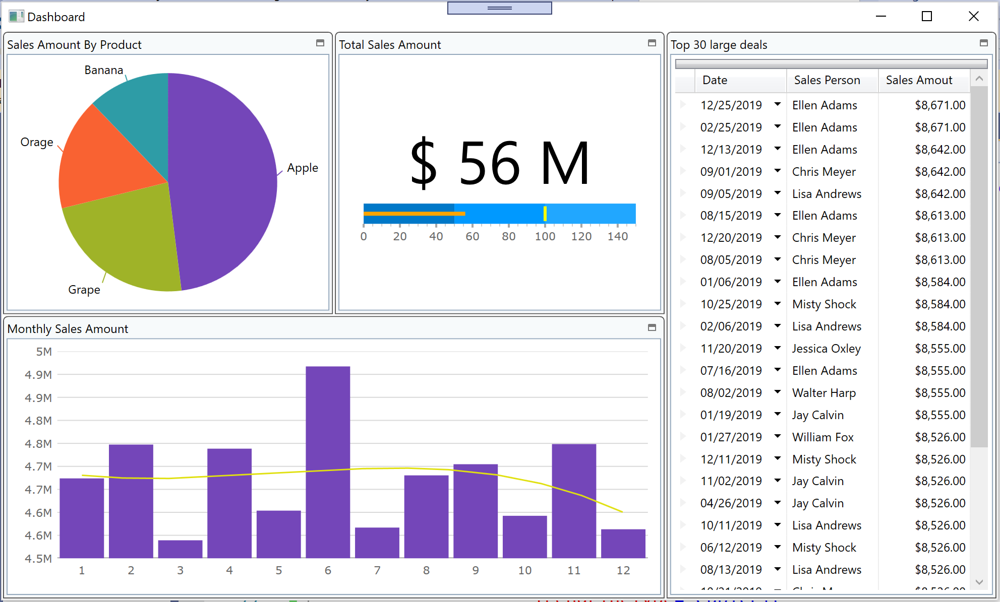

# Infragistics-WPF-Core3.0-Workshop

## About this workshop

This hands-on lab is for those 
- who want to build a solution for data visualization / analyzation
- who want to try Infragistics products in WPF application on .NET Core 3.0
- who are looking for rich and fast UI controls, e.g. grid and chart. 

Through this lab, you build an app for visualizing data with Infragistics controls on .NET Core 3.0 app

## Check your environment

Before starting this hands-on lab, check your environment to see if it's ready.

[Required Environment](docs/00-Environment.md)

## Application you build

Download the copy of this repository and find Infragistics-WPF-Core3.0-Workshop/src/before/InfragisticsDataVisualization which would be the start point of the workshop. 

This project has all Models and ViewModels required in the workshop but the views have empty so that you can focus on creating user interface on views. Please open it with Visual Studio and build to see if it can work on your PC.

Note that there's After folder which contains the expected project when you completed all instructions, Section 1 to Section 3.

## All steps

1. [Section 1 - Get started with Infragistics grid control](docs/01-Grid/01-00-Overview-of-Section1.md)
    1. [Get started with XamDataGrid](docs/01-Grid/01-01-Get-started-with-XamDataGrid.md)
    2. [Configure XamDataGrid](docs/01-Grid/01-02-Configure-XamDataGrid.md)
3. [Section 2 - Pivot Analytics](docs/02-Pivot/02-00-Overview-of-Section2.md)
    1. [Use FlatDataSource](docs/02-Pivot/02-01-Use-FlatDataSource.md)
    2. [Use Pivot Controls](docs/02-Pivot/02-02-Use-Pivot-Controls.md)
2. [Section 3 - Dashboard](docs/03-Dashboard/03-00-Overview-of-Section2.md)
    1. [Install Control Configulator](docs/03-Dashboard/03-01-Preparation-For-Section3.md)
    2. [Layout screen with XamTileManager](docs/03-Dashboard/03-02-Layout-screen-with-XamTileManager.md)
    3. [Configure PieChart](docs/03-Dashboard/03-03-Configure-PieChart.md)
    4. [Configure BulletGraph](docs/03-Dashboard/03-04-Configure-BulletGraph.md)
    5. [Configure Grid](docs/03-Dashboard/03-05-Configure-Grid.md)
    6. [Configure CategoryChart](docs/03-Dashboard/03-06-Configure-CategoryChart.md)

## What you create through this workshop.
Section 1 - Get started with Infragistics grid control

Section 2 - Create a dashboard with-Control Configulator

Section 3 - Create Self-BI UI with Pivot controls
