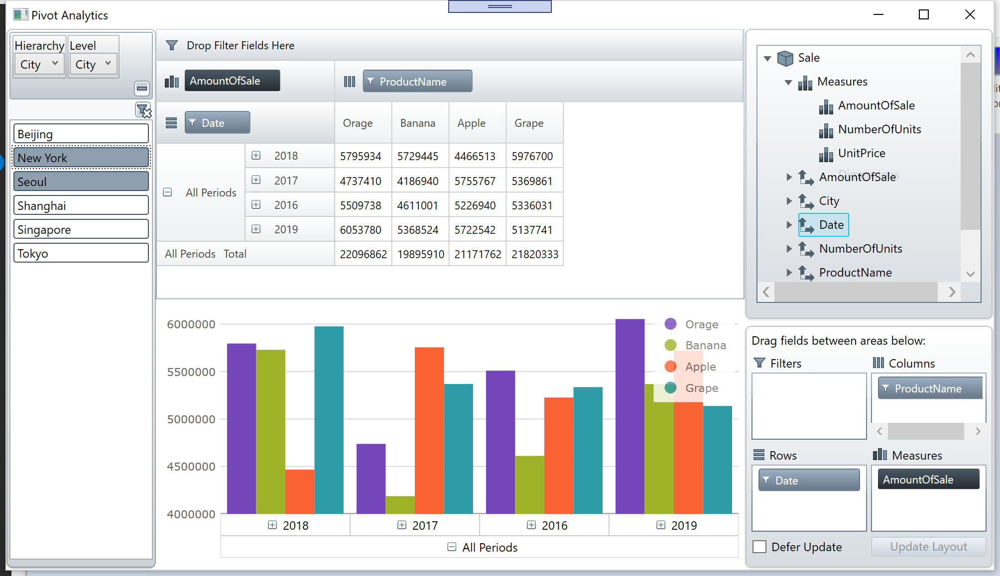

# Visualizing data with Infragistics on .NET Core 3.0

## About this hands-on lab

This hands-on lab is for developers 
- who want to build a solution for data visualization / analyzation
- who want to try Infragistics products in WPF application on .NET Core 3.0
- who are looking for rich and fast UI controls, e.g. grid and chart. 

Through this lab, you build an app for visualizing data with Infragistics controls on .NET Core 3.0 app

## What you build through this lab
Section 1 - DataGrid UI

Section 2 - Pivot Analytics UI

Section 3 - Dashboard UI

## Prerequisites

Before starting this hands-on lab, check your environment to see if it's ready.

[Required Environment](docs/00-Environment.md)

## .NET Core 3.0 project for the lab

Download the copy of this repository and find Infragistics-WPF-Core3.0-Workshop/src/before/InfragisticsDataVisualization which is the start point of the workshop. 

This project has all Models and ViewModels required in the workshop but the Views have empty so that you can focus on creating user interface on Views. Please open it with Visual Studio and build the project to see if it can work on your PC.

Note that there's After folder that contains the project same as the one when you completed all instructions, from Section 1 to Section 3. You can reference it while doing the lab.

## All steps

1. [Section 1 - DataGrid](docs/01-Grid/01-00-Overview-of-Section1.md)
    1. [Get started with XamDataGrid](docs/01-Grid/01-01-Get-started-with-XamDataGrid.md)
    1. [Configure XamDataGrid](docs/01-Grid/01-02-Configure-XamDataGrid.md)
1. [Section 2 - Pivot Analytics](docs/02-Pivot/02-00-Overview-of-Section2.md)
    1. [Use FlatDataSource](docs/02-Pivot/02-01-Use-FlatDataSource.md)
    1. [Use Pivot Controls](docs/02-Pivot/02-02-Use-Pivot-Controls.md)
1. [Section 3 - Dashboard](docs/03-Dashboard/03-00-Overview-of-Section3.md)
    1. [Preparation for Section3](docs/03-Dashboard/03-01-Preparation-For-Section3.md)
    1. [Layout screen with XamTileManager](docs/03-Dashboard/03-02-Layout-screen-with-XamTileManager.md)
    1. [Configure PieChart](docs/03-Dashboard/03-03-Configure-PieChart.md)
    1. [Configure BulletGraph](docs/03-Dashboard/03-04-Configure-BulletGraph.md)
    1. [Configure Grid](docs/03-Dashboard/03-05-Configure-Grid.md)
    1. [Configure CategoryChart](docs/03-Dashboard/03-06-Configure-CategoryChart.md)

## To run the project in After folder

There's After folder that contains the project same as the one when you completed all instructions. To run this project, you need to add Nuget packages listed below to the project.

- Infragistics.WPF.DataGrids
- Infragistics.WPF.Olap.FlatData
- Infragistics.WPF.PivotGrid
- Infragistics.WPF.PivotDataSlicer
- Infragistics.WPF.Charts.Olap
- Infragistics.WPF.Gauges
- Infragistics.WPF.TileManager