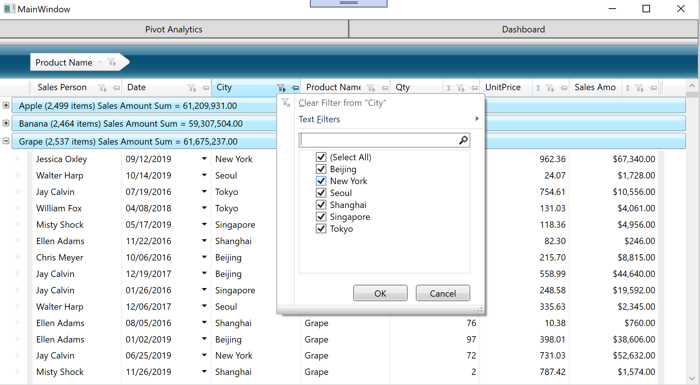

#  Data on a grid

In this section, display sales records on a grid conrtol to see the data to be anilized & visualized. You build rich grid UI with XamDataGrid in MainWindow.xaml.

## Steps
1. [Get started with XamDataGrid](01-01-Get-started-with-XamDataGrid.md)
3. [Configure XamDataGrid](01-02-Configure-XamDataGrid.md)

## What you build in this section

## Next

[Get started with XamDataGrid](01-01-Get-started-with-XamDataGrid.md)