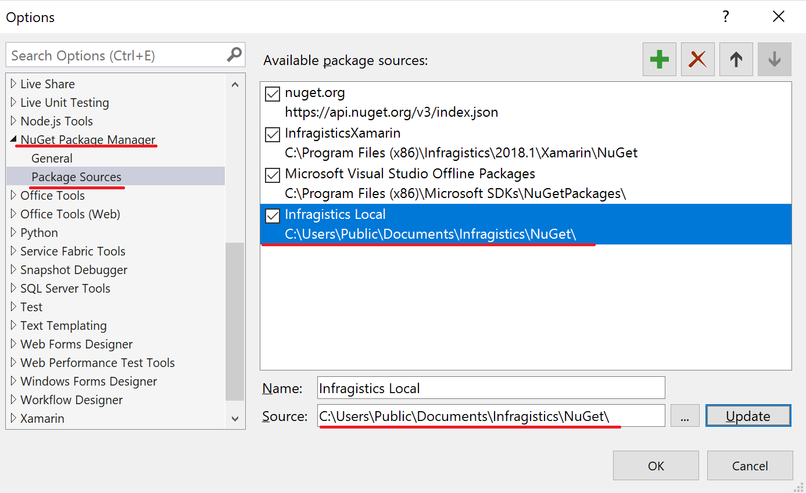
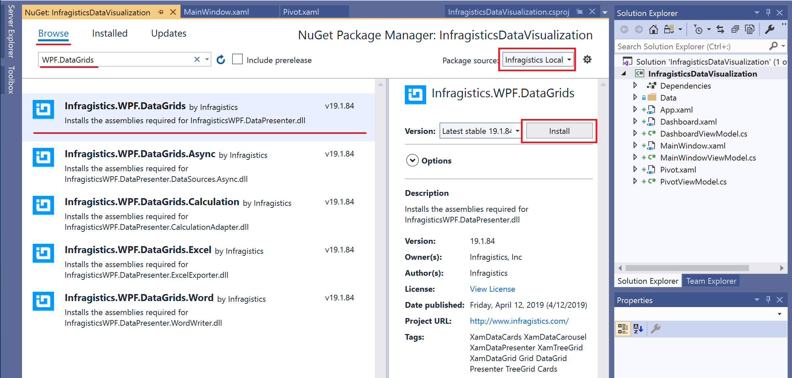
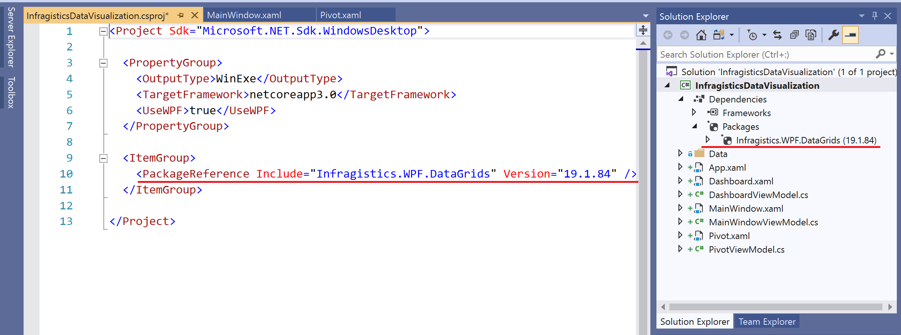
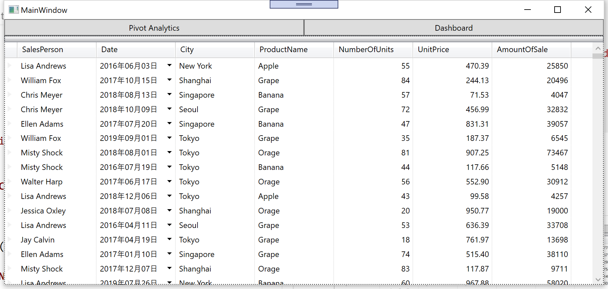

# Get started with XamDataGrid

When you use 3rd party library like Infragistics you need to add Nuget packages to the project to use them. After adding packages you can use them just like you develop with Common WPF Controls on XAML and C# code.

Open the project in "before" folder you downloaded, which is in Infragistics-WPF-Core3.0-Workshop/src/before.

## Check MainWindowViewModel.cs

Open MainWindowViewModel.cs and check what's in the class.

```cs
...
public ICommand OpenDashboard { get; set; }
public ICommand OpenBiWindow { get; set; }

public MainWindowViewModel()
{

    //Get sales data to be bound to grid
    SalesDataSample salesDataSample = new SalesDataSample();
    salesRecords = salesDataSample.SalesData;

    // Commands
    OpenDashboard = new OpenDashboardCommand();
    OpenBiWindow = new OpenPivotCommand();
}

private ObservableCollection<Sale> salesRecords;
public ObservableCollection<Sale> SalesRecords
{
    get { return salesRecords; }
}
...
    
```

This class has
 - SalesRecords to be bound to XamDataGrid
 - OpenDashboardCommand to bring up the dashboard window (used in the 2nd section)
 - OpenPivotCommand to bring up the BI window (used in the 3rd section)

## Check MainWindow.xaml

Open MainWindow.xaml and check what's in the xaml. *You don't have to write code here.
```xml
<Window x:Class="InfragisticsDataVisualization.MainWindow"
        xmlns="http://schemas.microsoft.com/winfx/2006/xaml/presentation"
        xmlns:x="http://schemas.microsoft.com/winfx/2006/xaml"
        xmlns:d="http://schemas.microsoft.com/expression/blend/2008"
        xmlns:mc="http://schemas.openxmlformats.org/markup-compatibility/2006"
        xmlns:local="clr-namespace:InfragisticsDataVisualization"
        mc:Ignorable="d"
        xmlns:vm="clr-namespace:InfragisticsDataVisualization.ViewModel"
        Title="MainWindow" Height="450" Width="800">
    <Window.DataContext>
        <vm:MainWindowViewModel/>
    </Window.DataContext>
    <Grid>
        <Grid.ColumnDefinitions>
            <ColumnDefinition Width="*"/>
            <ColumnDefinition Width="*"/>
        </Grid.ColumnDefinitions>
        <Grid.RowDefinitions>
            <RowDefinition Height="25px"/>
            <RowDefinition Height="*"/>
        </Grid.RowDefinitions>

        <Button Content="Pivot Analytics" Command="{Binding OpenBiWindow}" Grid.Column="0"/>
        <Button Content="Dashboard" Command="{Binding OpenDashboard}" Grid.Column="1"/>
    </Grid>
</Window>
```

This xaml has
 - MainWindowViewModel bound to this view
 - Grid Column/Row definitions to split and layout the screen
 - Two buttons to bring up another windows

## Set Nuget Package Source on Visual Studio

In order to use XamDataGrid control, you need to add references related to XamDataGrid to the project. On .NET Core project you need to add Nuget packages to add those references.

The first thing you need to do is to add a Nuget Package Source in the Package Sources menu on Visual Studio.

In Visual Studio 2019, select Tools -> Options -> Nuget Package Mannager -> Package Sources. Check if Infragistics Nuget package source (path is C:\Users\Public\Documents\Infragistics\NuGet\) is already added. If it's not added, click + icon to add it like below image.



## Add a Nuget package for XamDataGrid 

Add the Nuget package for DataGrid control, the below one.
- Infragistics.WPF.DataGrids

You have 2 options to add Nuget package to .NET Core 3.0 project as below.

### 1. Use dotnet command

Run the "dotnet add package" command by specifying the package you want to add like below.

`dotnet add package Infragistics.WPF.DataGrids`

Make sure you run the command at the directory that has the project file XXX.csproj.

### 2. on the "Manage Nuget Packages" dialog

Right click on the project in Solution Explorer, select "Manage Nuget Packages...". Select the name of the package source you just added ("Infragistics Local" in the image below), search by "WPF.DataGrids" on the Browse tab, select Infragistics.WPF.DataGrids and click the Install button.




Now the Nuget package is added and you can use XamDataGrid in the project.



## Add XamDataGrid

Open MainWindow.xaml. Add a namespace "http://infragistics.com/DataPresenter" with a prefix "igDP" and put the dinition of XamDataGrid as below. DataSource property is bound to SalesRecords comingfrom ViewModel.

MainWindow.xaml

```xml
<Window 
・・・
        xmlns:igDP="http://infragistics.com/DataPresenter"
        Title="MainWindow" Height="450" Width="800">
・・・
        <igDP:XamDataGrid DataSource="{Binding Path=SalesRecords}" Grid.Row="1" Grid.ColumnSpan="2"/>
    </Grid>
</Window>
```

## Check the result

Run the app and check the result.



## Note

XamDataGrid has a capability of generating column definitions automatically corresponding to the bound data. If you want to configure columns in detail you need to set AutoGenerateFields property to False and define all fields.

## Next
[01-02 Configure XamDataGrid](01-02-Configure-XamDataGrid.md)
