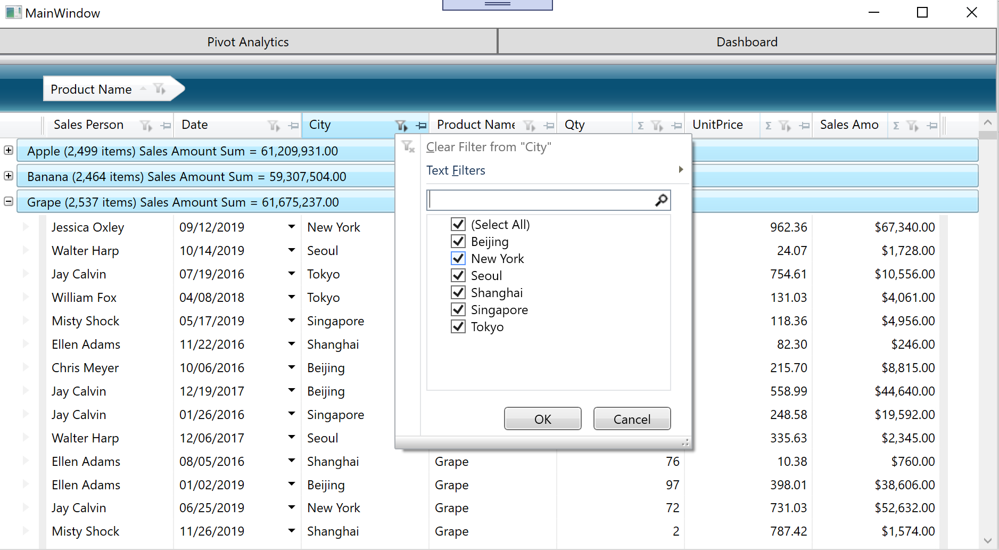

# Configure XamDataGrid
XamDataGrid has a lot of properties that allow you to implement required specifications and make your app more rich very easily.

## Setting some properties of XamDataGrid

Open MainWindow.xaml and set some properties of XamDataGrid to
- Enable Excel like filtering
- Enable column fixing
- Enable summary features
- Specify column type by defining all columns

```xml
...
<igDP:XamDataGrid DataSource="{Binding Path=SalesRecords}" Grid.Row="1" Grid.ColumnSpan="3" Grid.RowSpan="1"  >
    <igDP:XamDataGrid.FieldLayoutSettings>
        <igDP:FieldLayoutSettings FilterUIType="LabelIcons"/>
        
    </igDP:XamDataGrid.FieldLayoutSettings>
    <igDP:XamDataGrid.FieldSettings>
        <igDP:FieldSettings AllowRecordFiltering="True" FilterLabelIconDropDownType="MultiSelectExcelStyle" 
                        AllowSummaries="True" SummaryDisplayArea="InGroupByRecords" 
                        AllowFixing="NearOrFar"/>
    </igDP:XamDataGrid.FieldSettings>
    <igDP:XamDataGrid.FieldLayouts>
        <igDP:FieldLayout Key="Sale">
            <igDP:TextField Label="Sales Person" Name="SalesPerson" />
            <igDP:DateTimeField Name="Date" />
            <igDP:TextField Label="City" Name="City" />
            <igDP:TextField Label="Product Name" Name="ProductName" />
            <igDP:NumericField Label="Qty" Name="NumberOfUnits" />
            <igDP:NumericField Label="UnitPrice" Name="UnitPrice" />
            <igDP:CurrencyField Label="Sales Amount" Name="AmountOfSale" />
        </igDP:FieldLayout>
    </igDP:XamDataGrid.FieldLayouts>
</igDP:XamDataGrid>
...
```

## Check the result

Run the app and check the result.



## Note
XamDataGrid has a lot more properties you can use. If you want to know more about it please check the help and the API reference.

[XamDataGrid: Help and Reference](https://www.infragistics.com/help/wpf/xamdatagrid)

## Next
[Overview of Section2](../02-Pivot/02-00-Overview-of-Section2.md)
