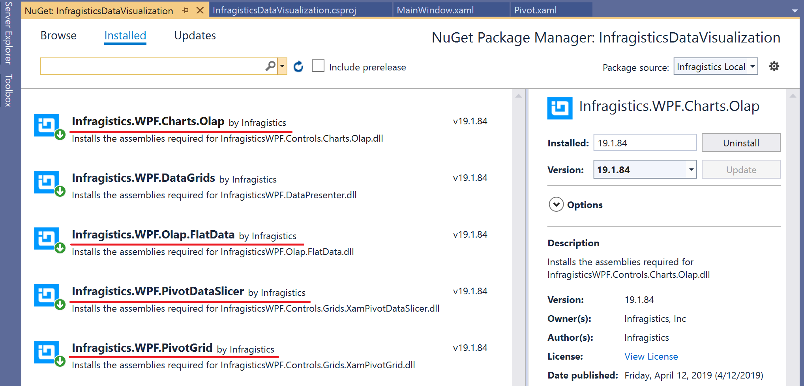

# Use FlatDataSource

If you have an olap server like SQL Analytics Server or Oracle Essbase, then you can connect olap data caluculated on Server side from Infragistics Pivot controls. If you don't have those analytics server functions, you can use FlatDataSource to be bound to Pivot controls, which can process BI requests, like filtering, slicing and drilling down, on your local machine (on your local memory).


## Add a Nuget package for Pivot & Chart controls

Add Nuget packages listed below as same as you did in the Section 1 for DataGrid.

- Infragistics.WPF.Olap.FlatData
- Infragistics.WPF.PivotGrid
- Infragistics.WPF.PivotDataSlicer
- Infragistics.WPF.Charts.Olap

`dotnet add package Infragistics.WPF.Olap.FlatData`<br>
`dotnet add package Infragistics.WPF.PivotGrid`<br>
`dotnet add package Infragistics.WPF.PivotDataSlicer`<br>
`dotnet add package Infragistics.WPF.Charts.Olap`<br>
`



## Define FlatDataSource in ViewModel

Open PivotViewModel.cs and define FlatDataSource to be bound to Pivot controls in View.

```cs
...
using Infragistics.Olap.FlatData;
...
    class PivotViewModel
    {
        public PivotViewModel()
        {
            // Get all data required in the pivot controls
            SalesDataSample salesDataSample = new SalesDataSample();
            // Added ↓↓↓
            var flatDataSource = new Infragistics.Olap.FlatData.FlatDataSource();
            flatDataSource.ItemsSource = salesDataSample.SalesData;
            salesFlatDataSource = flatDataSource;
            // Added ↑↑↑
        }

        // Added ↓↓↓
        //Flat DataSource to be bound to pivot controls
        private FlatDataSource salesFlatDataSource;
        public FlatDataSource SalesFlatDataSource
        {
            get { return salesFlatDataSource; }
        }
        // Added ↑↑↑
...
```

Now ViewModel class has
 - SalesFlatDataSource to be bound to pivot controls.
 
 Note that SalesDataSample.SalesData is same data as the datasource in the Section 1.

## Note

If you want to know more about FlatDataSource and other supported data sources check the following help topics.

[Binding xamPivotGrid to FlatDataSource](https://www.infragistics.com/help/wpf/xampivotgrid-databinding-using-flatdatasource)

[Supported DataSource other than FlatDataSource](https://www.infragistics.com/help/wpf/xampivotgrid-binding-data-to-the-xampivotgrid)

## Next
[02-02 Use Pivot Controls](02-02-Use-Pivot-Controls.md)
