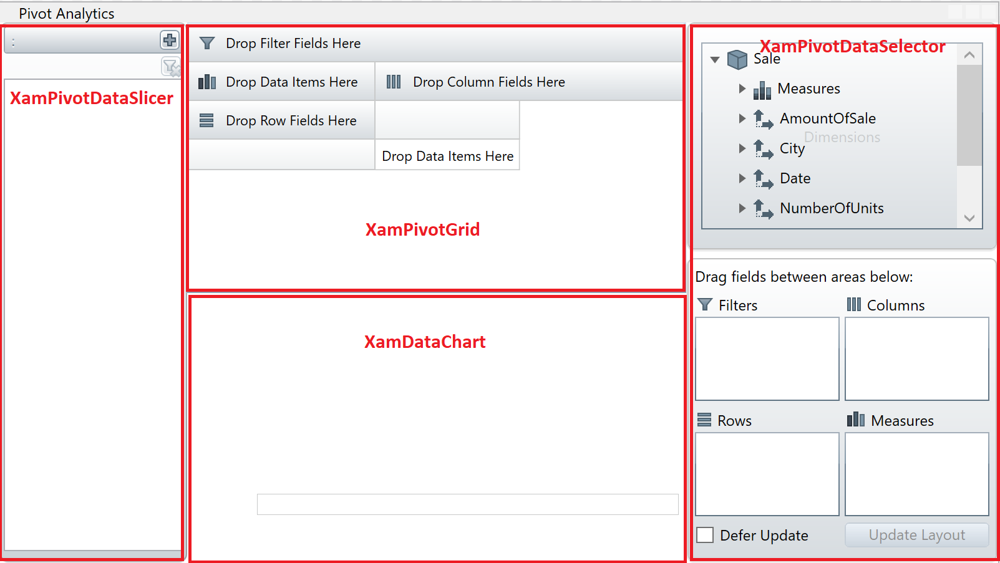
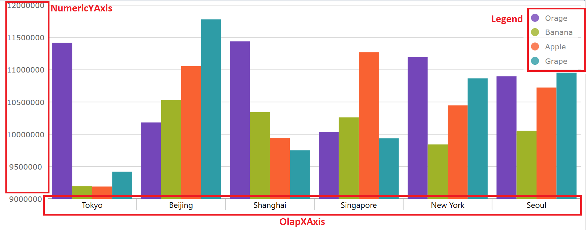
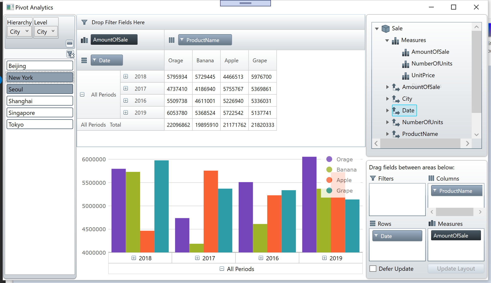

# Use Pivot Controls

## Check Pivot.xaml

Open Pivot.xaml and check what's in the xaml.

Pivot.xaml

```xml
<Window x:Class="IgWpfWorkshop.Pivot"
        xmlns="http://schemas.microsoft.com/winfx/2006/xaml/presentation"
        xmlns:x="http://schemas.microsoft.com/winfx/2006/xaml"
        xmlns:d="http://schemas.microsoft.com/expression/blend/2008"
        xmlns:mc="http://schemas.openxmlformats.org/markup-compatibility/2006"
        xmlns:local="clr-namespace:IgWpfWorkshop"
        mc:Ignorable="d"
        Title="Pivot" Height="600" Width="1000"
        xmlns:vm="clr-namespace:IgWpfWorkshop.ViewModel">
    <Window.DataContext>
        <vm:PivotViewModel/>
    </Window.DataContext>
    <Grid>
        <Grid.RowDefinitions>
            <RowDefinition Height="*"/>
            <RowDefinition Height="*"/>
        </Grid.RowDefinitions>
        <Grid.ColumnDefinitions>
            <ColumnDefinition Width="150"/>
            <ColumnDefinition Width="*"/>
            <ColumnDefinition Width="250"/>
        </Grid.ColumnDefinitions>
        
    </Grid>
</Window>

```

This xaml has
 - PivotViewModel bound to this view
 - Grid Column/Row definitions to split and layout the screen

## Add Pivot controls and a DataChart control

Open Pivot.xaml. Add a namespace "http://schemas.infragistics.com/xaml" with a prefix "ig" and add following controls to XAML.

 - XamPivotGird - Top center
 - XamPivotDataSelector - Right side
 - XamPivotDataSlicer - Left side
 - XamDataChart - Bottom center



```xml
<Window 
・・・
        xmlns:ig="http://schemas.infragistics.com/xaml"
        Title="Pivot Analytics" Height="450" Width="800">
...
        <ig:XamPivotGrid Grid.Column="1" Grid.RowSpan="1" />
        <ig:XamPivotDataSelector Grid.Column="2" Grid.RowSpan="2" />
        <ig:XamPivotDataSlicer Grid.Column="0" Grid.RowSpan="2" />
        <ig:XamDataChart Grid.Column="1" Grid.Row="1" />
    </Grid>
</Window>
```

## Configure XamPivotGrid

Bind XamPivtGrid to SalesFlatDataSource.

```xml
...
<ig:XamPivotGrid Grid.Column="1" Grid.RowSpan="1" DataSource="{Binding Path=SalesFlatDataSource}" />
...
```

## Configure XamPivotDataSelector

Bind XamPivotDataSelector to SalesFlatDataSource.

```xml
...
<ig:XamPivotDataSelector Grid.Column="2" Grid.RowSpan="2" DataSource="{Binding Path=SalesFlatDataSource}" />
...
```

## Configure XamPivotDataSlicer

Bind XamPivotDataSlicer to SalesFlatDataSource. Note that you should set SlicerProvider but not DataSource property.

```xml
...
<ig:XamPivotDataSlicer Grid.Column="0" Grid.RowSpan="2" SlicerProvider="{Binding Path=SalesFlatDataSource}"/>
...
```

## Configure XamPivotGrid

Bind XamDataChart to SalesFlatDataSource and configure some properties related chart axis and legend as below code. 

In order to display OLAP data in the XamDataChart control, you need to configure a special type of axis – OlapXAxis – specifically designed for visiualizing multi-dimensional data sets

```xml
...
<ig:XamDataChart 
    Grid.Column="1" 
    Grid.Row="1" 
    Legend="{Binding ElementName=Legend}">
    <ig:XamDataChart.Axes>
        <ig:NumericYAxis Name="YAxis"></ig:NumericYAxis>
        <ig:OlapXAxis 
        DataSource="{Binding Path=SalesFlatDataSource}" 
        YAxis="{Binding ElementName=YAxis}" 
        OlapAxisSource="Rows"></ig:OlapXAxis>
    </ig:XamDataChart.Axes>
</ig:XamDataChart>
<ig:Legend x:Name="Legend"
        Grid.Column="1" Grid.Row="1"
        HorizontalAlignment="Right"
        VerticalAlignment="Top"
        Background="white" Opacity="0.8">
</ig:Legend>
...
```



## Check the result

Run the app and check the result.



## Note
If you want to know more about pivot controls please check the following help topic.

## Next
[Overview of Section2](../03-Dashboard/03-00-Overview-of-Section3.md)
