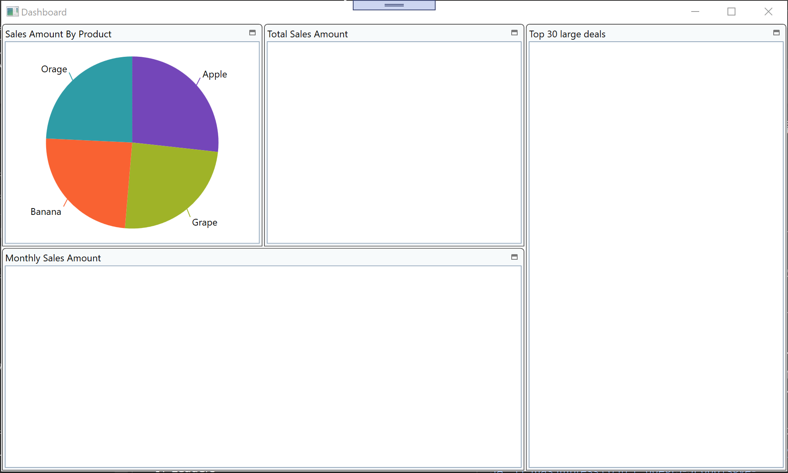

# Configure PieChart

You add a pie chart here to express the ratio of the amount of sales by products. You use XamPieChart for thatin this step.

## Check the datasource to be bound to XamPieChart

Open DashboardViewModel.cs, set a breakpoint and start debugging to see what's in the bound data SalesAmountByProduct. That should be like below 

| AmountOfSale | ProductName |
----|---- 
| 123 | Banana |
| 456 | Grape |
| ... | ... |

## Put XamPieChart

In Dashboard.xaml, add XamPieChart in the first tile.

Dashboard.xaml

```xml
...
<ig:XamTile
    Header="Sales Amount By Product"
    ig:XamTileManager.Column="0"
    ig:XamTileManager.Row="0" 
    ig:XamTileManager.ColumnSpan="1"
    ig:XamTileManager.RowSpan="1">
    <ig:XamPieChart />
</ig:XamTile>
...
```

## Configure XamPieChart

Set properties on the PieChart as below

- ItemsSource (required)
    - Property for Binding data. Bind to SalesAmountByProductData in this case.
- LabelMemberPath (required)
    - A string specifying the property name on the data model to be used as value. Set "ProductName" in this case.
- ValueMemberPath (required)
    - A string specifying the property name on the data model to be used as label. Set "AmountOfSale" in this case.
- LabelsPosition (optional)
    - An enumerated type that specifies how labels are arranged. Set "OutsideEnd" in this case
- StartAngle (optional)
    - The offset angle, in degrees, at which pie slices start to be rendered. Set a number between 0 and 360

```xml
...
<ig:XamPieChart 
    ItemsSource="{Binding SalesAmountByProductData}" 
    LabelMemberPath="ProductName" 
    ValueMemberPath="AmountOfSale"
    LabelsPosition="OutsideEnd" 
    StartAngle="270" />
...
```

## Check the result

Run the app and check the result.



## Note

If you want to learn more about XamPieChart, check the help topic here.

[Getting Started with XamPieChart
Getting Started](https://www.infragistics.com/help/wpf/piechart-getting-started-with-piechart)

## Next
[02-04 Configure BulletGraph](02-04-Configure-BulletGraph.md)
