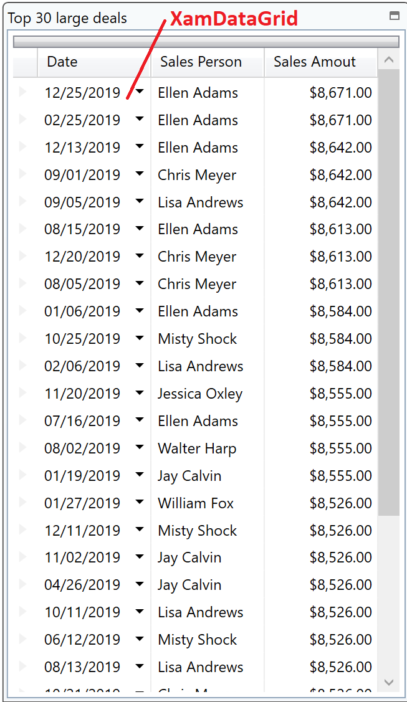
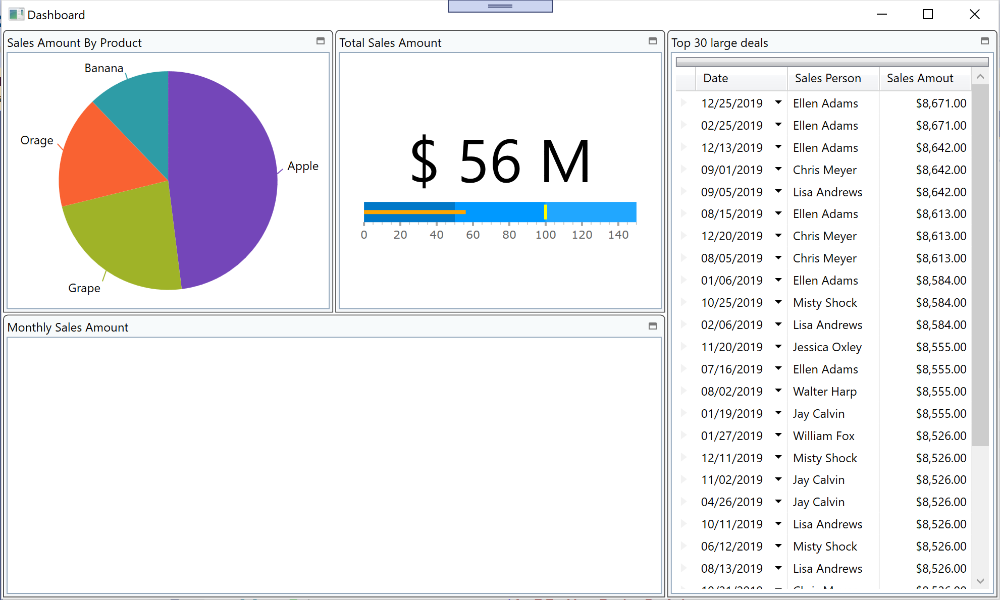

# Configure Grid

You add a grid here to dispaly the top 30 large deals on a dashboard. You use XamDataGrid for that in this step.



## Check the datasource to be bound to XamDataGrid.

Open DashboardViewModel.cs, set a breakpoint and start debugging to see what's in the bound data Top30LargeDeals. That should be like below.

| AmountOfSale | City | Date | NumberOfUnits | ProductName | SalesPerson | UnitPrice |
----|----|----|----|----|----|----
123 | Singapore | 2018/01/01 | 123 | Banana | Lisa Andrews | 123
456 | New York | 2018/02/02 | 456 | Grape | William Fox | 456
... | ... | ... | ... | ... | ... | ...

Note that the data is already ordered by AmountOfSale and extracted the top 30 recoreds.

## Add XamDataGrid

Open Dashboard.xaml. Add a namespace of "http://infragistics.com/DataPresenter" with a prefix "igDP".

```xml
<Window 
・・・
        xmlns:ig="http://schemas.infragistics.com/xaml"
        xmlns:igDP="http://infragistics.com/DataPresenter"
        xmlns:vm="clr-namespace:InfragisticsDataVisualization.ViewModel">
・・・
```

Add XamDataGrid on the 3rd tile.

Dashboard.xaml

```xml
...
<ig:XamTile
    Header="Top 30 large deals"
    ig:XamTileManager.Column="2"
    ig:XamTileManager.Row="0" 
    ig:XamTileManager.ColumnSpan="1"
    ig:XamTileManager.RowSpan="2">
    <igDP:XamDataGrid/>
</ig:XamTile>
...
```

## Configure XamDataGrid.

Set properties on the XamDataGrid as below

- DataSource (required)
    - Bind to Top30LargeDeals.
- AutoFit (optional)
    - If True, all columns are automatically sized to fit within the record.
- FieldLayoutSettings.AutoGenerateFields (optional)
    - If it's True, grid automatically generate columns based on the bound data model. Set "False" in this case.
- FieldLayouts (optional)
    - Define fields and specify filed type. In this case, define 3 fields as below to display Date, SalesPerson and AmountOfSale.

```xml
<igDP:XamDataGrid DataSource="{Binding Path=Top30LargeDeals}" AutoFit="True" >
    <igDP:XamDataGrid.FieldLayoutSettings>
        <igDP:FieldLayoutSettings AutoGenerateFields="False" />
    </igDP:XamDataGrid.FieldLayoutSettings>
    <igDP:XamDataGrid.FieldLayouts>
        <igDP:FieldLayout Key="Sale">
            <igDP:DateTimeField Name="Date" />
            <igDP:TextField Label="Sales Person" Name="SalesPerson" />
            <igDP:CurrencyField Label="Sales Amout" Name="AmountOfSale" />
        </igDP:FieldLayout>
    </igDP:XamDataGrid.FieldLayouts>
</igDP:XamDataGrid>
...
```

## Check the result

Run the app and check the result.



## Note
If you want to learn more about XamDataGrid, check the help topic.

[Adding xamDataGrid to Your Page](https://www.infragistics.com/help/wpf/xamdatagrid-getting-started-with-xamdatagrid)

## Next
[02-06 Configure CategoryChart](02-06-Configure-CategoryChart.md)
