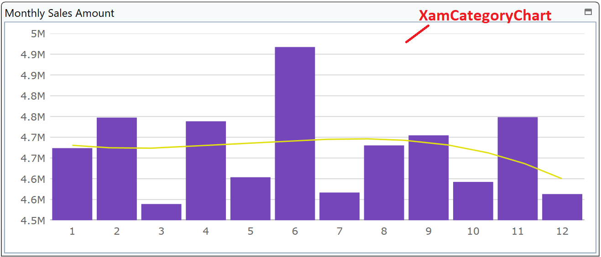

# Configure CategoryChart

You add a chart here to express monthly sales trend. You use CategoryChart for that in this step.



Note: You used XamDataChart in section 2. You might come up with a question what's the difference between XamDataChart and XamCategoryChart... See the Note on the bottom of this step.


## Check the datasource to be bound to XamCategoryChart

Open DashboardViewModel.cs, set a breakpoint and start debugging to see what's in the bound data MonthlySalesAmount. That should be like below.

| Month | AmountOfSale |
----|---- 
| 1 | 123 |
| 2 | 456 |
| ... | ... |

## Add XamCategoryChart

In Dashboard.xaml, add XamCategoryChart on the 4th tile.

Dashboard.xaml

```xml
...
<ig:XamTile
    Header="Monthly Sales Amount"
    ig:XamTileManager.Column="0"
    ig:XamTileManager.Row="1" 
    ig:XamTileManager.ColumnSpan="2"
    ig:XamTileManager.RowSpan="1" >
    <ig:XamCategoryChart />
</ig:XamTile>
...
```

## Configure XamCategoryChart.

Set properties on the XamDataGrid as below

- ItemsSource (required)
    - Bind to MonthlySalesAmount.
- ChartType (optional)
    - Set chart type e.g. "Column" or "Line".
- XAxisInterval (optional)
    - Interval for X axis labels. Set "1" in this case.
- TrendLineType (optional)
    - If you want to display a trend line specify trend line type on this property. Set "CubicFit" in this case.
- TrendLineBrushes (optional)
    - Trend line's color. Set a color you like.

```xml
<ig:XamCategoryChart 
    ItemsSource="{Binding Path=MonthlySalesAmount}" 
    ChartType="Column" 
    XAxisInterval="1"
    TrendLineType="CubicFit" 
    TrendLineBrushes="#E0E010"/>
...
```

## Check the result

Run the app and check the result.


## Note

XamCategoryChart is a lightweight chart. It can be easily configured to display category data using an extremely simple and intuitive API, compared with XamDataChart. XamDataChart has a lot more APIs so it's more configurable and  customizable.

[Getting Started with XamCategoryChart](https://www.infragistics.com/help/wpf/categorychart-walkthrough)

[Getting Started with XamDataChart](https://www.infragistics.com/help/wpf/datachart-getting-started-with-datachart)
