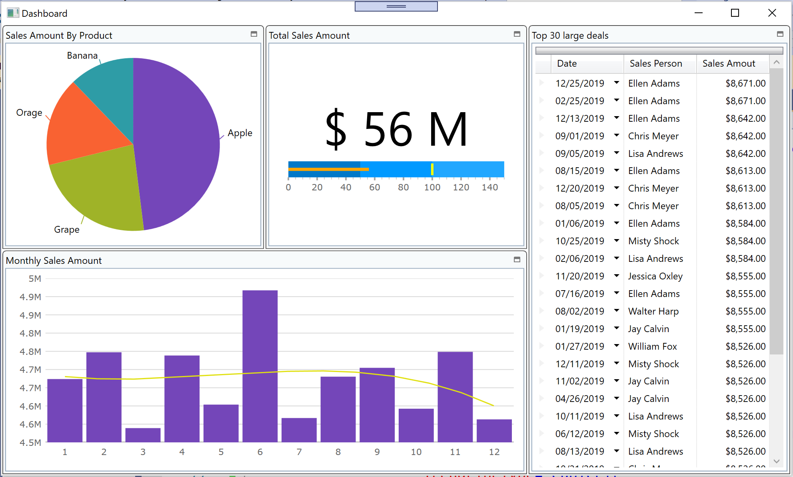

# Create dashboard with Control Configulator

In Section 2, you built a pivot UI which is useful when user wants to analyze data, but might be a little bit hard to use it for non-IT users as it requires IT literacy for data analytics.

In section 3, you build a Dashboard UI with chart and graph controls. Dashbaord UI can be accessed quickly & easily from evey users and it supports highly informed decision making.

## Steps
1. [Preparation for Section3](03-01-Preparation-For-Section3.md)
2. [Layout screen with XamTileManager](03-02-Layout-screen-with-XamTileManager.md)
3. [Configure PieChart](03-03-Configure-PieChart.md)
4. [Configure BulletGraph](03-04-Configure-BulletGraph.md)
5. [Configure Grid](03-05-Configure-Grid.md)
6. [Configure CategoryChart](03-06-Configure-CategoryChart.md)

## What you build in this section

## Next
[03-01 Preparation for Section3](03-01-Preparation-For-Section3.md)