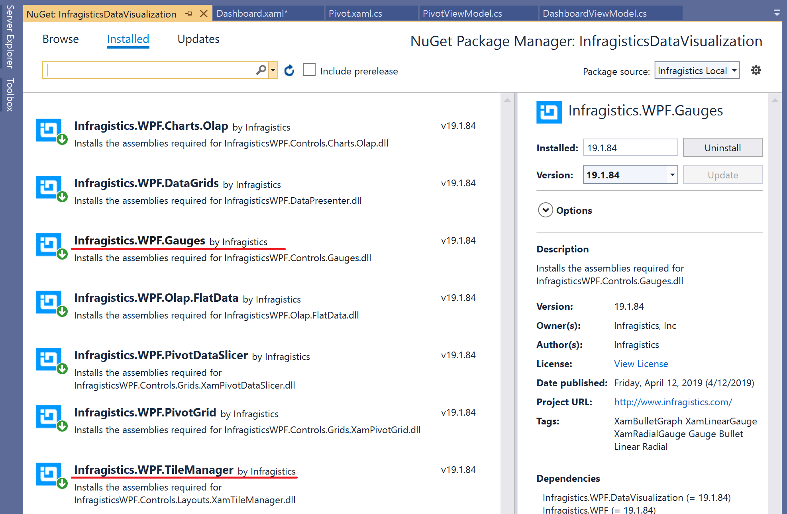

# Preparation for Section3

In this Step, check data in ViewModel bound to each dashboard widget, then add required Nuget packages to the project.

## Check data in ViewModel

Open DashboardViewModel.cs and check what's in the class. There are some properties to be bound to View side.

- SalesAmountByProductData (ObservableCollection)
    - To show sales amount by products on a Piechart
- MonthlySalesAmount (ObservableCollection)
    - To show monthly sales amount on a chart
- SalesTargetThisYear (int), TotalSalesThisYear (int)
    - To show sales achievement level on a bullet graph 
- Top30LargeDeals (ObservableCollection)
    - To show the top 30 large deals on a grid

Note that you don't write code here but check what's in the View and the ViewModel in this section.

## Add a Nuget package for Tile & Gauge controls

Add Nuget packages listed below as same as you did in the Section 1 & 2.

- Infragistics.WPF.Gauges
- Infragistics.WPF.TileManager

`
dotnet add package Infragistics.WPF.Gauges
dotnet add package Infragistics.WPF.TileManager
`

## Note

## Next
[03-02 Layout screen with XamTileManager](03-02-Layout-screen-with-XamTileManager.md)
