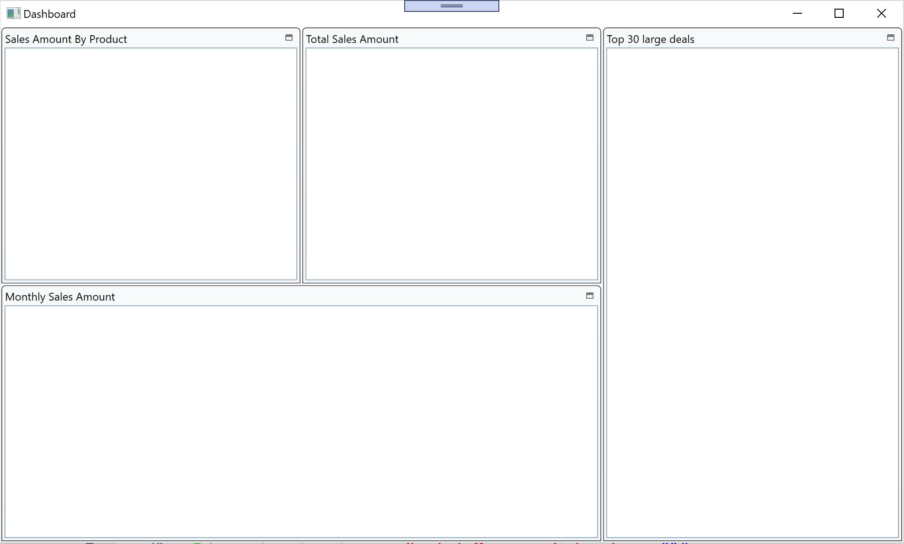

# Layout window with XamTileManager


## Add TileManager control and Layout tiles

Open Dashboard.xaml. Add a namespace "http://schemas.infragistics.com/xaml" with a prefix "ig".

```xml
<Window 
・・・
        xmlns:ig="http://schemas.infragistics.com/xaml"
        xmlns:vm="clr-namespace:InfragisticsDataVisualization.ViewModel">
・・・
```

Add XamTileManager and some tiles for dashboard widgets in it. Layout tiles by configuring some properties as below. *Just copy & paste the code below to your project since it's not so important writing all code by hand here.

Dashboard.xaml

```xml
...
<Grid>
    <ig:XamTileManager>
        <ig:XamTileManager.NormalModeSettings>
            <ig:NormalModeSettings TileLayoutOrder="UseExplicitRowColumnOnTile"
                                    VerticalTileAreaAlignment="Stretch"
                                    HorizontalTileAreaAlignment="Stretch">
                <ig:NormalModeSettings.TileConstraints>
                    <ig:TileConstraints PreferredWidth="400" PreferredHeight="300"/>
                </ig:NormalModeSettings.TileConstraints>
            </ig:NormalModeSettings>
        </ig:XamTileManager.NormalModeSettings>

        <ig:XamTile
            Header="Sales Amount By Product"
            ig:XamTileManager.Column="0"
            ig:XamTileManager.Row="0" 
            ig:XamTileManager.ColumnSpan="1"
            ig:XamTileManager.RowSpan="1">
        </ig:XamTile>

        <ig:XamTile
            Header="Total Sales Amount"
            ig:XamTileManager.Column="1"
            ig:XamTileManager.Row="0" 
            ig:XamTileManager.ColumnSpan="1"
            ig:XamTileManager.RowSpan="1">
        </ig:XamTile>

        <ig:XamTile
            Header="Top 30 large deals"
            ig:XamTileManager.Column="2"
            ig:XamTileManager.Row="0" 
            ig:XamTileManager.ColumnSpan="1"
            ig:XamTileManager.RowSpan="2">
        </ig:XamTile>

        <ig:XamTile
            Header="Monthly Sales Amount"
            ig:XamTileManager.Column="0"
            ig:XamTileManager.Row="1" 
            ig:XamTileManager.ColumnSpan="2"
            ig:XamTileManager.RowSpan="1" >
        </ig:XamTile>
    </ig:XamTileManager>
</Grid>
...
```

XamTileManager has 4 tiles which are for
 - Displaying Sales Amount By Product in a **PieChart**
 - Displaying Total Sales Amount in a **BulletGraph**
 - Displaying Top 30 large deals in a **Grid**
 - Displaying Monthly Sales Amount in a **Chart**

## Check the result

Run the app and check the result. You can change the tile layout by dragging & dropping or clicking on the tile icon.



## Note
You can learn more about XamTileManager in the help topic.

[Using xamTileManager](https://www.infragistics.com/help/wpf/xamtilemanager-using-xamtilemanager)

Infragistics WPF contains another nice layout control named XamDockManager which provides experience like Visual Studio docking pane. If you have some time to give it try, check the help topic and try it!

[Using xamDockManager](https://www.infragistics.com/help/wpf/xamdockmanager-using-xamdockmanager)


## Next
[03-03 Configure PieChart](03-03-Configure-PieChart.md)
