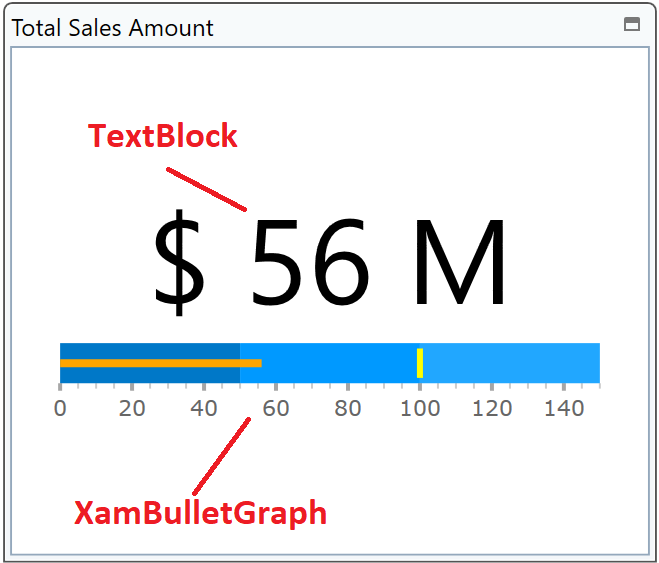
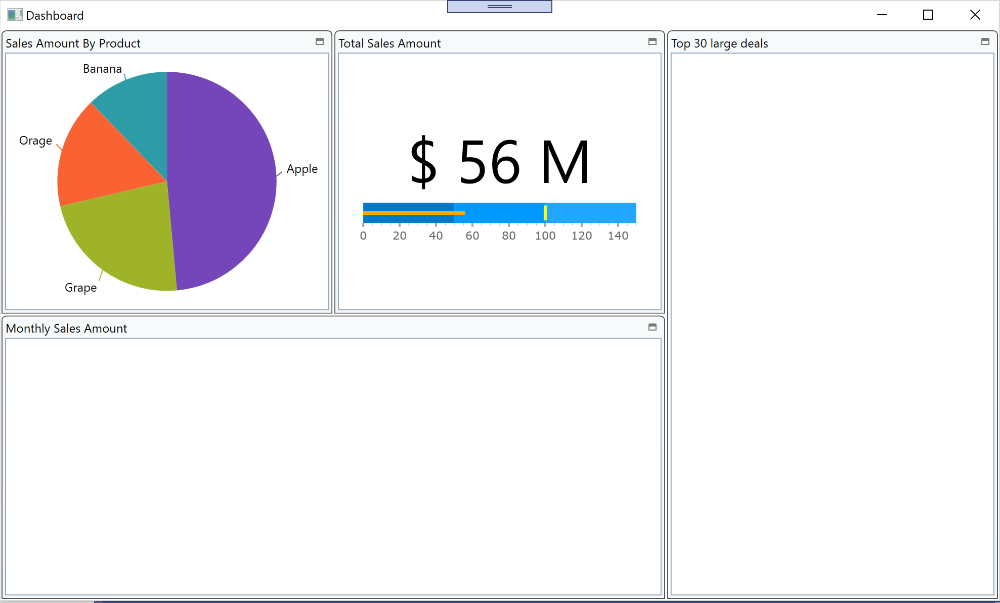

# Configure BulletGraph

You add a bullet graph here to express how the sales forecast this year goes on compared to the sales target. You use XamBulletGraph for that in this step.



## Check the datasource to be bound to XamBulletGraph.

Open DashboardViewModel.cs, set a breakpoint and start debugging to see what's in the bound data TotalSalesThisYear and SalesTargetThisYear. Each property should return interger value.

## Put XamBulletGraph

In Dashboard.xaml, put XamBulletGraph on the second tile and reset its layout. You would like to put not only a bullet graph but also a TextBlock above the graph to display the value with large size font. Put the TextBlock and the XamBulletGraph inside a StackPanel as below.

Dashboard.xaml

```xml
...
<ig:XamTile
    Header="Total Sales Amount in this year"
    ig:XamTileManager.Column="1"
    ig:XamTileManager.Row="0" 
    ig:XamTileManager.ColumnSpan="1"
    ig:XamTileManager.RowSpan="1">
    <StackPanel VerticalAlignment="Center" >
        <TextBlock/>
        <ig:XamBulletGraph/>
    </StackPanel>
</ig:XamTile>
...
```

## Add XamBulletGraph and TextBlock

In Dashboard.xaml, add a StackPanel in the second tile and put TextBlock and XamPieChart in it as below

Dashboard.xaml

```xml
...
<ig:XamTile
    Header="Total Sales Amount"
    ig:XamTileManager.Column="1"
    ig:XamTileManager.Row="0" 
    ig:XamTileManager.ColumnSpan="1"
    ig:XamTileManager.RowSpan="1">
    <StackPanel VerticalAlignment="Center" >
        <TextBlock />
        <ig:XamBulletGraph />
    </StackPanel>
</ig:XamTile>
...
```

## Configure XamBulletGraph

Set properties on the BulletGraph as below

- TargetValue (required)
    - Target number. Bind to SalesTargetThisYear in this case.
- Value (required)
    - Current number again the target. Bind to TotalSalesThisYear in this case.
- Interval (optional)
    - Interval for scale labels. Set "20" in this case.
- MaximumValue (optional)
    - Maximum value on a graph. Set "150" in this case.
- TargetValueBrush (optional)
    - Fill color for the target bar. Set a color you like.
- ValueBrush (optional)
    - Fill color for the value bar. Set a color you like.
- Ranges (optional)
    - In order to compare the value displayed by the performance bar against some meaningful range(s) of values, these comparative ranges need to be displayed on the scale. Set 3 ranges on the BulletGraph in this case.

```xml
<ig:XamBulletGraph 
    TargetValue="{Binding SalesTargetThisYear}" 
    Value="{Binding TotalSalesThisYear}" 
    Interval="20" 
    MaximumValue="150" 
    TargetValueBrush="Yellow" 
    ValueBrush="Orange">
    <ig:XamBulletGraph.Ranges>
        <ig:XamLinearGraphRange EndValue="50" StartValue="0" />
        <ig:XamLinearGraphRange EndValue="100" StartValue="50" />
        <ig:XamLinearGraphRange EndValue="150" StartValue="100" />
    </ig:XamBulletGraph.Ranges>
</ig:XamBulletGraph>
...
```

## Bind TextBlock to TotalSales.

Bind TextBlock to TotalSalesThisYear and configure it as below.

Dashboard.xaml

```xml
...
<TextBlock HorizontalAlignment="Center" TextWrapping="Wrap" FontSize="80" Text="{Binding Path=TotalSalesThisYear, StringFormat= $ {0} M }"/>
...
```

## Check the result

Run the app and check the result.



## Note
If you want to learn more about XamBulletGraph, check the help topic here.
[Adding Bullet Graph](https://www.infragistics.com/help/wpf/bulletgraph-adding)

## Next
[03-05 Configure Grid](03-05-Configure-Grid.md)
